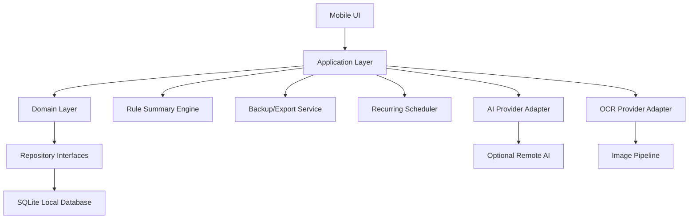
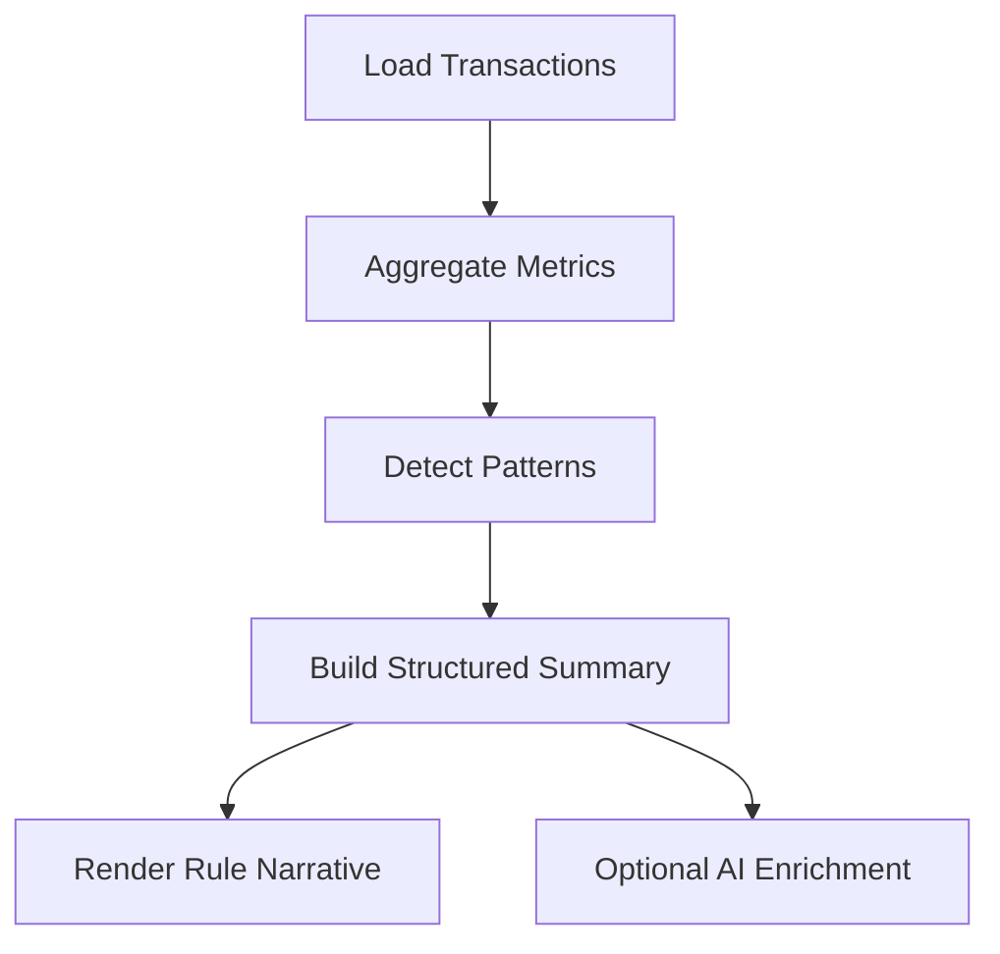

# Feature Design

## Overview

这个项目的设计目标不是一次性做成“大而全”的财务系统，而是先做出一个稳定、低打扰、能每天打开使用的极简记账 App，再逐步把 AI 能力作为增强层接入。

设计原则：

- 核心记账能力必须离线可用、无账号依赖
- AI、OCR、自动总结属于外挂增强，不反向绑死核心流程
- 所有写入型 AI 能力都必须先生成草稿，再由用户确认
- 先保证录入速度、可修改性、数据安全，再做智能化
- 数据结构一次设计清楚，为 `v0.3` 之后的 AI 能力预留扩展位

本设计文档默认按推荐选项推进。如果你后续改了某个决策项，文档中的分层和数据模型大多仍可复用。

## Decision Checklist

以下项目属于实施前建议先拍板的决策项。当前文档将按“已确认选项”设计。

规则：

- 后续凡是新增需要拍板的事项，都必须先补进这份决策清单
- 每个决策项都必须列出推荐选项、备选项和推荐原因
- 未进入清单的事项，不做隐式重大决策

### D1 - 客户端技术栈

- 推荐：`React Native + Expo + TypeScript`
- 已确认：`React Native + Expo + TypeScript`
- 备选：
  - `Flutter`
  - `Tauri + Web`
- 推荐原因：
  - 适合做移动端优先的个人工具
  - 本地存储、图片选择、文件导出、后续 OCR 接入都比较顺手
  - TypeScript 对后续 AI provider 抽象和开源协作更友好

### D2 - 本地存储方案

- 推荐：`SQLite`
- 已确认：`SQLite`
- 备选：
  - `Realm`
  - `AsyncStorage`
- 推荐原因：
  - 交易记录、周期规则、总结缓存都天然适合结构化存储
  - 便于做查询、筛选、统计和后续迁移
  - 比 `AsyncStorage` 更适合长期演进

### D3 - 状态管理方案

- 推荐：`Zustand + Repository Hooks`
- 已确认：`Zustand + Repository Hooks`
- 备选：
  - `Redux Toolkit`
  - `Jotai`
- 推荐原因：
  - 足够轻
  - 比较适合个人项目和开源练手项目
  - 不会让本地 CRUD 逻辑过度复杂

### D4 - 导航结构

- 推荐：`记账 / 回顾 / 设置`
- 已确认：`记账 / 回顾 / 设置`
- 备选：
  - `首页 / 流水 / 设置`
  - `首页 / 统计 / 设置`
  - 单页结构 + 多个弹层
- 推荐原因：
  - “记账”入口必须最高优先级，保证打开就能录
  - “回顾”可以承载月统计、流水回看和自动总结，比单纯“统计”更贴近产品目标
  - 设置页保留低频管理能力，避免打断核心路径

### D5 - 同步与账号策略

- 推荐：`v0.1-v0.2 不做账号系统，只做本地存储 + 导出备份`
- 已确认：`v0.1-v0.2 不做账号系统，只做本地存储 + 导出备份`
- 备选：
  - 邮箱登录 + 云同步
  - 第三方登录 + 云备份
- 推荐原因：
  - 更符合“做给自己用”的起步目标
  - 可以显著降低工程复杂度
  - 对“极简、无打扰、可开源”定位更一致

### D6 - 自动总结实现路径

- 推荐：`先规则引擎，后 AI 改写与增强`
- 已确认：`先规则引擎，后 AI 改写与增强`
- 备选：
  - 从第一版起就完全由 AI 生成总结
- 推荐原因：
  - 规则总结可验证、可测试、离线可用
  - 可以尽早让“自动总结”上线，而不被模型能力阻塞
  - 后续 AI 只需要增强可读性和发现模式，不必重写总结框架

### D7 - AI 接入方式

- 推荐：`Provider 抽象 + 远程模型优先 + 自由接入`
- 已确认：`Provider 抽象 + 远程模型优先 + 自由接入`
- 备选：
  - 直接把某个 AI SDK 写进业务逻辑
  - 强绑定单一服务商
- 推荐原因：
  - 便于开源
  - 便于关闭、替换或新增模型 provider
  - 让无 AI 配置的用户也能运行基础版本
  - 满足“优先远程模型，但不锁死服务商”的要求

### D8 - OCR 接入策略

- 推荐：`v0.4 再接入，且只生成待确认草稿`
- 已确认：`v0.4 再接入，且只生成待确认草稿`
- 备选：
  - v0.1 就接 OCR
  - OCR 识别后自动入账
- 推荐原因：
  - 可以避免过早引入图片处理复杂度
  - 降低误识别造成脏数据的风险

## Architecture

## High-Level Architecture

系统采用“核心记账域 + 本地数据层 + 可选智能服务层”的分层结构。



### Layer Responsibilities

- `UI Layer`
  - 页面、弹层、表单、列表、图表
  - 不直接处理数据库和 AI 细节
- `Application Layer`
  - 编排“记一笔”“编辑”“生成月报”“导出备份”等用例
- `Domain Layer`
  - 定义交易、分类、周期规则、总结结果等核心模型
- `Repository Layer`
  - 统一封装本地读写逻辑
- `Service Layer`
  - 总结规则引擎
  - 周期交易调度
  - 备份导入导出
  - 可插拔的 AI / OCR provider

## Product Structure

### 页面结构

#### 1. 记账页

职责：

- 默认承载快速记账主流程
- 展示今日或本月的轻量概览
- 展示最近记录，方便刚录完就修正
- 保持“打开即可记”的主入口体验

关键模块：

- 快速记账表单或底部面板
- 今日/本月概览卡片
- 最近记录列表

#### 2. 回顾页

职责：

- 查看月度统计、自动总结与交易流水
- 按月份、分类、关键词筛选
- 编辑、删除、撤销记录

关键模块：

- 月度概览卡片
- 自动总结卡片
- 交易列表
- 筛选栏
- 月份切换
- 交易详情弹层

#### 3. 设置页

职责：

- 分类管理
- 备份与恢复
- 导出数据
- AI / OCR 能力开关与配置
- App 偏好设置

关键模块：

- 数据管理
- 分类管理
- 周期规则入口
- 实验能力配置

### 高优先级交互

#### 快速记账

推荐流程：

1. 用户打开 App 默认进入记账页
2. 系统默认聚焦金额输入
3. 用户选择收入或支出
4. 用户选择分类
5. 用户可选填写备注与时间
6. 保存后停留在“可继续记下一笔”的状态

设计目标：

- 常见场景 2-3 步完成
- 编辑成本低
- 不强制填多余字段

#### 月末自动总结

推荐流程：

1. 月份切换或到达月末时间点
2. 系统运行规则总结引擎
3. 生成结构化总结结果
4. 记账页轻量概览与回顾页展示自然语言卡片
5. 用户点击卡片可查看依据明细

## Components and Interfaces

### AppShell

- 目的：承载导航、主题、全局弹层和初始化流程
- 输入：本地配置、数据库初始化状态
- 输出：各页面容器

### TransactionComposer

- 目的：创建和编辑交易记录
- 核心能力：
  - 手动录入
  - 从自然语言草稿写入
  - 从 OCR 草稿写入
- 约束：
  - 所有 AI/OCR 入口都必须最终落到同一份交易表单

### TransactionList

- 目的：展示流水并支持修正
- 核心能力：
  - 列表分页或按月加载
  - 搜索、筛选、编辑、删除
  - 支持显示来源标记，如 `manual`、`nlp`、`ocr`

### SummaryEngine

- 目的：生成规则型自动总结
- 输入：
  - 某一时间范围内的交易
  - 上一个对比周期的汇总数据
- 输出：
  - 结构化总结对象
  - 可渲染的卡片文案

职责边界：

- `v0.1-v0.2` 只输出规则结论
- `v0.5` 可以将结构化结论交给 AI 改写，但 AI 不直接替代规则引擎

### RecurringTransactionService

- 目的：处理周期交易
- 核心能力：
  - 定义规则
  - 生成候选记录
  - 去重和确认

### BackupService

- 目的：导出和恢复本地数据
- 输出格式：
  - `CSV`
  - `JSON`

### AIProvider

- 目的：为自然语言和总结增强提供统一接口
- 设计要求：
  - 默认优先接入远程模型
  - 必须支持通过 provider 配置自由替换不同服务
  - 未配置 provider 时不影响基础记账能力
- 接口示意：

```typescript
interface AIProvider {
  parseTransactionText(input: string): Promise<TransactionDraft>;
  enrichSummary(input: SummaryInput): Promise<SummaryNarrative>;
}
```

### OCRProvider

- 目的：从票据或截图生成交易草稿
- 接口示意：

```typescript
interface OCRProvider {
  extractTransactionFromImage(imageUri: string): Promise<TransactionDraft>;
}
```

## Data Models

核心原则：

- 所有来源最终都汇入同一交易模型
- 记录来源和原始输入，便于追踪 AI/OCR 结果
- 规则型总结和 AI 总结都基于统一统计结果

### Transaction

```typescript
type TransactionType = "expense" | "income";
type TransactionSource = "manual" | "recurring" | "nlp" | "ocr" | "import";

interface Transaction {
  id: string;
  type: TransactionType;
  amountMinor: number;
  currency: string;
  categoryId: string;
  merchant?: string;
  note?: string;
  occurredAt: string;
  source: TransactionSource;
  sourceRefId?: string;
  createdAt: string;
  updatedAt: string;
  deletedAt?: string;
}
```

说明：

- `amountMinor` 使用最小货币单位，避免浮点误差
- `v0.1` 阶段 `currency` 固定为 `CNY`，字段保留仅为后续扩展多币种
- `source` 标记来源，方便后续分析不同录入方式的表现
- `deletedAt` 支持软删除和撤销

### Category

```typescript
interface Category {
  id: string;
  name: string;
  type: "expense" | "income" | "both";
  color?: string;
  icon?: string;
  sortOrder: number;
  isDefault: boolean;
  createdAt: string;
  updatedAt: string;
}
```

### RecurringRule

```typescript
interface RecurringRule {
  id: string;
  type: TransactionType;
  amountMinor: number;
  categoryId: string;
  merchant?: string;
  note?: string;
  cadence: "daily" | "weekly" | "monthly" | "yearly";
  interval: number;
  startAt: string;
  endAt?: string;
  lastGeneratedAt?: string;
  autoCreateDraft: boolean;
  enabled: boolean;
}
```

### TransactionDraft

```typescript
interface TransactionDraft {
  type?: TransactionType;
  amountMinor?: number;
  currency?: string;
  categoryId?: string;
  merchant?: string;
  note?: string;
  occurredAt?: string;
  confidence?: number;
  rawInput?: string;
  rawImageUri?: string;
}
```

说明：

- 供自然语言和 OCR 共用
- `v0.1` 到 `v0.5` 默认都以人民币为主，后续如需多币种可在此模型上扩展
- 在用户确认前，不写入正式交易表

### SummarySnapshot

```typescript
interface SummarySnapshot {
  id: string;
  periodType: "day" | "week" | "month";
  periodStart: string;
  periodEnd: string;
  totalExpenseMinor: number;
  totalIncomeMinor: number;
  netBalanceMinor: number;
  topCategoryId?: string;
  comparisonExpenseDeltaPct?: number;
  comparisonIncomeDeltaPct?: number;
  generatedBy: "rules" | "rules+ai";
  narrative?: string;
  generatedAt: string;
}
```

### AIArtifact

```typescript
interface AIArtifact {
  id: string;
  kind: "transaction_parse" | "ocr_extract" | "summary_enrich";
  inputRefId?: string;
  rawInput: string;
  rawOutput: string;
  model?: string;
  status: "success" | "fallback" | "rejected";
  createdAt: string;
}
```

说明：

- 用于保留 AI/OCR 结果，便于调试与纠错
- 基础版本不依赖该表，但未来能力可以直接接入

## Storage Design

推荐使用单库表结构：

- `transactions`
- `categories`
- `recurring_rules`
- `summary_snapshots`
- `ai_artifacts`
- `app_settings`

### Repository Interfaces

```typescript
interface TransactionRepository {
  create(input: Transaction): Promise<void>;
  update(id: string, patch: Partial<Transaction>): Promise<void>;
  softDelete(id: string): Promise<void>;
  listByMonth(month: string): Promise<Transaction[]>;
  search(query: TransactionQuery): Promise<Transaction[]>;
}
```

这种做法的好处：

- UI 不直接依赖 SQLite 语句
- 后续可以替换 ORM 或者增加同步层
- 便于测试

## Summary System Design

### 规则总结引擎

`v0.1` 起就实现，作为自动总结的真实基础。

最小输出建议：

- 本期总收入
- 本期总支出
- 净结余
- 最大支出分类
- 相比上期的变化
- 重复/周期支出提示

### 生成流程



### AI 总结增强

到 `v0.5` 再启用：

- 输入不是原始交易全量文本，而是结构化统计结果
- 输出是增强可读性的简报和洞察
- 如果 AI 结果与规则数据冲突，优先展示规则结果

## Error Handling

### 交易录入

- 金额为空或非法时阻止保存
- 分类缺失时提醒选择默认分类
- 写库失败时提示重试，并保留当前表单内容

### 编辑与删除

- 删除采用软删除
- 删除后提供短暂撤销入口
- 编辑失败时不覆盖原始记录

### 周期交易

- 生成前检测是否已存在同周期记录，避免重复造单
- 规则无效时提示用户修复

### AI 与 OCR

- 解析失败时回退到手动编辑
- 低置信度字段必须显式标记
- 不允许 AI/OCR 在未确认情况下直接入账

### 备份与恢复

- 导入前校验 schema 版本
- 部分导入失败时给出失败清单
- 恢复流程默认先生成临时快照

## Privacy and Security

- 核心版本默认本地优先
- 不强制登录
- AI 能力默认可关闭
- AI 调用前应明确提示“哪些数据将发送到外部服务”
- 导出文件默认不做隐式上传

## Testing Strategy

### Unit Tests

- 金额转换与格式化
- 总结规则引擎
- 周期交易生成逻辑
- Repository 查询与写入行为
- AI/OCR provider 的 fallback 逻辑

### Integration Tests

- 创建交易后记账页与回顾页是否同步更新
- 编辑、删除、撤销是否保持统计一致
- 月末总结是否按预期生成
- 导出后再导入是否保持数据一致

### UI Tests

- 快速记账主流程
- 月份切换与筛选
- 周期交易确认流程
- AI 草稿确认流程
- OCR 草稿确认流程

### Performance Considerations

- 月视图和回顾页按月分页加载
- 记账页轻量统计与回顾页聚合统计使用缓存快照
- AI/OCR 处理与 UI 分离，避免阻塞主交互

## Rollout Mapping

### v0.1

- 交付：
  - 手动记账
  - 人民币单币种支持
  - 回顾页查看与编辑
  - 月度统计
  - 规则型自动总结
  - 本地存储

### v0.2

- 新增：
  - 周期交易
  - 搜索筛选
  - 备份恢复
  - `CSV + JSON` 导出能力

### v0.3

- 新增：
  - 自然语言转交易草稿
  - AI provider 接口落地

### v0.4

- 新增：
  - OCR 图片识别
  - 图片草稿确认

### v0.5

- 新增：
  - AI 总结增强
  - 消费模式洞察
  - 异常与订阅提示

## Confirmed Decisions

当前已确认如下事项：

1. 技术栈使用 `React Native + Expo + TypeScript`
2. 一级导航使用 `记账 / 回顾 / 设置`
3. `v0.1` 仅支持人民币，默认 `CNY`
4. `v0.2` 导出同时支持 `CSV` 和 `JSON`
5. AI 采用 `远程模型优先 + provider 自由接入`

## Future Decision Rule

后续如果出现新的关键实现分歧，例如 UI 方案、测试框架、数据库封装层、AI provider 默认实现，必须先补一份“决策清单 + 推荐选项”，再继续推进实现。
