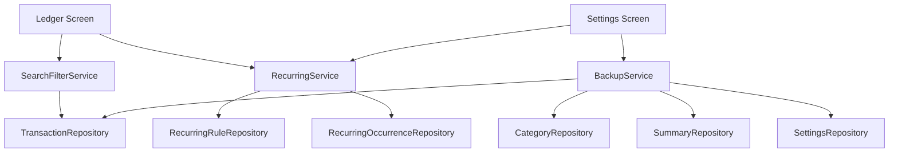

# v0.2 Stage Design

## Stage Goal

`v0.2` 的目标不是继续堆页面，而是在保持极简感的前提下，补齐“长期自用”最容易卡住的两类问题：

- 重复输入太多，记账开始变烦
- 数据只在手机里，迁移和恢复不安心

这个阶段要解决的是：

- 周期性支出 / 收入不用每次重新敲
- 历史记录能按月份、分类、关键词快速找到
- 数据可以导出、备份、恢复
- 高频录入场景给出轻量候选，但不引入复杂模板系统

这个阶段继续保持：

- Android 优先
- 离线可用
- 数据只存本地
- 不依赖账号
- 不接 AI / OCR
- 不做多币种

## Scope

### 本阶段纳入范围

1. 周期交易规则
2. 到期记录生成与确认
3. 记账页历史搜索与筛选
4. 常用分类 / 常用金额候选
5. `CSV` 导出
6. `JSON` 备份与恢复
7. 恢复前校验与临时快照

### 本阶段明确不做

1. 用户自定义快捷模板管理
2. 其他 App 的 `CSV` 导入
3. 云同步 / 登录 / 多设备同步
4. OCR / 自然语言 AI 记账
5. 多币种、多账本

## Confirmed Decisions

### 已确认项

1. 技术栈延续 `Expo + React Native + TypeScript + SQLite + Zustand`
2. 导航结构仍为 `记账 / 回顾 / 设置`
3. 周期交易默认采用“到期生成待确认项”，而不是无感自动入账
4. 搜索主入口放在 `记账` 页，不把 `回顾` 页做成第二个搜索中心
5. `CSV` 用于通用导出，`JSON` 用于完整备份与恢复
6. 恢复流程默认是“先做临时快照，再执行本地替换恢复”
7. `v0.2` 可做常用分类 / 常用金额候选，但暂不做快捷模板管理

## Why These Priorities

需求依据已在以下研究文档中整理：

- `sources/research_20260418_minimal_expense_app_user_voice.md`

对 `v0.2` 最有指导意义的结论是：

1. 备份、导出、可迁移不是锦上添花，而是长期使用的信任基础
2. 周期交易和未来已知支出，是“极简”场景里非常高价值的效率功能
3. 本地优先、离线可用、无登录依赖，仍然是这个产品方向的核心约束

## Product Strategy

### 1. 效率增强要轻，不要把快记账做重

`v0.2` 的效率增强不走“模板中心”路线，而是走轻量辅助：

- 周期交易处理重复场景
- 常用分类 / 常用金额做候选提示
- 搜索和筛选帮助快速回找、修正

这样可以保持你想要的“极简快记”，而不是把首页变成功能集合页。

### 2. 数据安全优先级高于炫技功能

`v0.2` 的备份恢复要做到：

- 用户知道数据保存在本地
- 用户知道如何导出一份自己可读的数据
- 用户知道如何在换机或误删后恢复

所以这里会优先做：

- `CSV` 导出
- `JSON` 完整备份
- `JSON` 恢复校验

而不是先做外部导入、聚合报表或更复杂的自动化。

## Screen Changes

### 1. 记账页

`记账` 页仍然是高频入口，但会新增两个能力：

1. 搜索与筛选
2. 周期交易到期提醒

#### 页面新增结构

1. 顶部搜索框
   - 支持关键词搜索备注、商家、分类名
2. 筛选入口
   - 月份
   - 分类
   - 收支类型
3. 到期待确认区
   - 展示已生成但未确认的周期交易项
   - 支持确认入账、跳过、稍后处理

#### 设计原则

- 搜索和筛选保持轻量，不做复杂高级搜索页
- 到期项应比普通列表更醒目，但不能压过记账主流程
- 搜索结果与普通流水使用同一套列表组件，避免维护双份 UI

### 2. 记账弹窗

保留 `v0.1` 的底部大弹窗形态，只做轻量增强：

1. 展示最近常用分类候选
2. 在金额输入后提供少量常用金额建议
3. 当入口来自周期交易待确认项时，自动带入草稿字段

不新增：

- 模板管理入口
- 模板编辑页
- 复杂规则组合

### 3. 回顾页

`回顾` 页在 `v0.2` 继续以时间范围总结为主，不承担全文搜索主入口。

可做的补强：

- 当前范围下增加分类筛选复用
- 从回顾页跳转到对应流水或编辑项

不建议做的事：

- 把回顾页也做成完整搜索页
- 在这里再塞一套独立筛选表单

### 4. 设置页

`设置` 页是 `v0.2` 变化最大的页面，会新增两个卡片区：

1. 周期交易管理
   - 查看规则列表
   - 新增规则
   - 暂停 / 启用规则
   - 删除规则
2. 数据管理
   - 导出 `CSV`
   - 导出 `JSON`
   - 从 `JSON` 恢复
   - 恢复前确认提示

## Architecture

## High-Level Additions

在现有 `v0.1` 架构上，`v0.2` 新增三类核心能力：

1. `RecurringService`
2. `SearchFilterService`
3. `BackupService`



## Components and Interfaces

### RecurringService

- 目的：处理周期交易规则、到期生成、确认和跳过
- 设计原则：
  - 规则本身与真实交易分离
  - 到期项先生成待确认记录，再由用户决定是否入账
  - 避免重复生成同一天同一规则的待确认项

#### 职责

1. 新增 / 编辑 / 暂停 / 删除周期规则
2. 计算规则下一个到期日
3. 生成待确认 occurrence
4. 确认后写入真实交易，`source = recurring`
5. 跳过后记录状态，避免重复提醒

### SearchFilterService

- 目的：统一记账页的历史搜索与筛选
- 设计原则：
  - 只做够用的移动端筛选
  - 查询尽量在 SQLite 层完成
  - 结果仍复用现有按天分组流水结构

#### 支持条件

1. 月份
2. 分类
3. 收支类型
4. 关键词

### BackupService

- 目的：导出可读数据，并提供本地恢复能力
- 设计原则：
  - `CSV` 面向查看和迁移
  - `JSON` 面向完整备份和恢复
  - 不做隐式上传
  - 恢复前先生成临时快照

## Data Models

### 1. 周期规则

```typescript
interface RecurringRule {
  id: string;
  type: 'expense' | 'income';
  amountMinor: number;
  currency: 'CNY';
  categoryId: string;
  note?: string | null;
  frequency: 'weekly' | 'monthly' | 'yearly';
  intervalCount: number;
  anchorDate: string; // YYYY-MM-DD
  nextOccurrenceDate: string; // YYYY-MM-DD
  status: 'active' | 'paused';
  createdAt: string;
  updatedAt: string;
}
```

### 2. 周期到期项

```typescript
interface RecurringOccurrence {
  id: string;
  ruleId: string;
  plannedDate: string; // YYYY-MM-DD
  status: 'pending' | 'confirmed' | 'skipped';
  confirmedTransactionId?: string | null;
  createdAt: string;
  updatedAt: string;
}
```

### 3. 搜索筛选参数

```typescript
interface LedgerSearchFilters {
  monthKey?: string;
  categoryId?: string;
  transactionType?: 'expense' | 'income';
  keyword?: string;
}
```

### 4. 备份载荷

```typescript
interface BackupPayloadV2 {
  schemaVersion: 2;
  exportedAt: string;
  app: {
    name: 'JotIt';
    version: string;
  };
  settings: AppSettings;
  categories: Category[];
  transactions: TransactionRecord[];
  summarySnapshots: SummarySnapshot[];
  recurringRules: RecurringRule[];
  recurringOccurrences: RecurringOccurrence[];
}
```

## Database Changes

`v0.2` 需要把数据库版本从 `1` 升到 `2`。

### 新增表

1. `recurring_rules`
2. `recurring_occurrences`

### 现有查询增强

1. `transactions` 增加关键词搜索条件
2. `transactions` 增加按月份 / 类型 / 分类筛选
3. 为搜索和恢复补充必要索引

## Export and Restore Design

### `CSV` 导出

推荐包含字段：

- 交易 ID
- 日期
- 收支类型
- 金额
- 币种
- 分类 ID
- 分类名
- 备注
- 来源
- 创建时间
- 更新时间

用途：

- 自己查看
- 表格软件打开
- 后续迁移到别的工具

### `JSON` 备份

特点：

- 保留结构化关系
- 可完整恢复本地数据
- 包含 schema 版本

### 恢复策略

采用“整库替换恢复”而不是“智能合并恢复”：

1. 先导出当前本地数据作为临时快照
2. 校验 `schemaVersion`
3. 校验关键字段完整性
4. 用事务清空并写入恢复数据
5. 完成后刷新全局状态

这样可以把复杂度控制在你这个练手项目能稳住的范围内。

## Error Handling

### 周期交易

- 同一规则同一到期日不得重复生成 occurrence
- 规则失效或分类被删除时，要给出可恢复提示
- 确认失败时不能产生半条交易

### 搜索筛选

- 无结果时显示清晰空状态
- 筛选条件冲突时允许一键清空
- 关键词为空时回退普通列表

### 导出与恢复

- 导出失败时明确提示“未写出文件”
- 用户取消分享或保存不视为错误恢复
- 恢复校验失败时保持现有本地数据不变
- 恢复中断时回滚事务并保留临时快照

## Testing Strategy

### Unit Tests

- 周期规则下一次到期日计算
- occurrence 去重逻辑
- 关键词 / 月份 / 分类筛选查询
- `CSV` 序列化
- `JSON` 备份结构校验
- 恢复 schema 校验与错误分支

### Integration Tests

- 周期规则确认后是否生成真实交易并刷新列表
- 导出后再恢复是否保持数据一致
- 搜索筛选后列表分组是否正确
- 常用分类 / 常用金额候选是否来自近期真实记录

### UI Tests

- 新增周期规则流程
- 到期项确认 / 跳过流程
- 记账页搜索与筛选
- 设置页导出与恢复流程

## Risks

### 风险 1 - 周期交易把极简流程做重

缓解方式：

- 不做复杂 cron
- 默认只有 `周 / 月 / 年`
- 先做“待确认项”，不做静默自动记账

### 风险 2 - 恢复逻辑破坏现有数据

缓解方式：

- 恢复前先生成本地临时快照
- 恢复过程使用事务
- 只支持 `JSON` 完整恢复，不做半结构化导入

### 风险 3 - 搜索和筛选让记账页顶部过于拥挤

缓解方式：

- 默认只露出搜索框和一个筛选按钮
- 复杂条件收进底部筛选面板
- 清空筛选操作始终一键可达

## Next Step

当前 `v0.2` 设计可以直接进入实现拆分。

实现顺序建议：

1. 数据模型与 migration
2. 周期交易
3. 搜索筛选
4. 常用候选
5. 导出 / 备份 / 恢复
6. 自动化测试补齐
